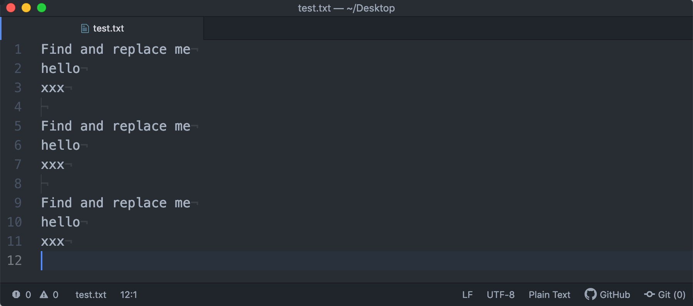

# multiple-find-replace

Multiple (or batch) Find and Replace using a template file as reference.

## Options

- it works in whole document if nothing is selected or just in selection if there is something selected.

- split sintax can be customized in the package settings.

- case sensitive or insensitive option for *FIND* command.

- it also works not only with individual words but also with strings.

- package setting to disable notifications

## Usage

1) The first time it is launched it will create a template file where the *FIND* and *REPLACE* statements should be placed.

2) Use the splitter sintax (by default it is ' => ') to split the *FIND* and *REPLACE* statements, the FIND one goes on the left and the *REPLACE* one on the right:

> Find and replace me => Replaced!

3) Each line will represent a *FIND* and *REPLACE* command, use as many lines as you wish in your template file

4) Save the template file

5) Launch the Replace command by keyboard shortcut, menus or contextual menu.

6) Enjoy!
